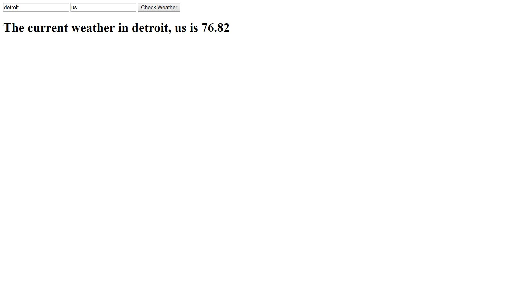

Weather API
This app uses the openweathermap API to allow the user to enter their city and country and give them the current temperature.

Link to project:

How It's Made:
Tech used: HTML, CSS, JavaScript, jQuery, API
An ajax request is made to the API and if it's a success the weather and temperature will be taken from the API and be printed into the dom with the .html method.

Lessons Learned:
I never knew an API could take live info and display it for you I always thought API's used information that was stored in a database or something.

Examples:
Take a look at these couple examples that I have in my own portfolio:

Examples:
Take a look at these couple examples that I have in my own portfolio:
